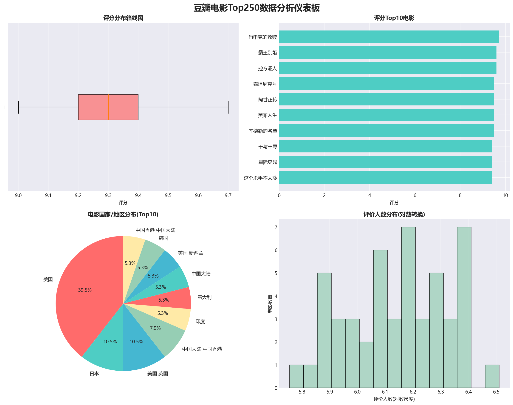

# [Crawler_app1] - [基于 Python 的豆瓣电影爬虫]


## 📖 项目介绍 | Project Overview

* **爬虫项目:** 这是一个多线程爬虫，用于抓取 XX 网站的数据并进行分析...

## 📸 运行截图 | Screenshots


> 图1：爬取数据结果展示

## 🛠️ 技术栈 | Tech Stack

* **语言:** Python
* **库:** Requests, Pandas
* **数据库:** SQLite

## 🚀 如何运行 | How to Run

1.  克隆项目
    ```bash
    git clone [https://github.com/nanfeilaotou/Crawler_app1.git](https://github.com/nanfeilaotou/Crawler_app1.git)
    ```
2.  安装依赖
    * Python: `pip install -r requirements.txt`
3.  运行
    * Python: `python douban_analysis.py`

## ⚠️ 注意事项

* 本爬虫仅供学习交流，请勿用于商业用途。

---
**作者:** [刘文昊]